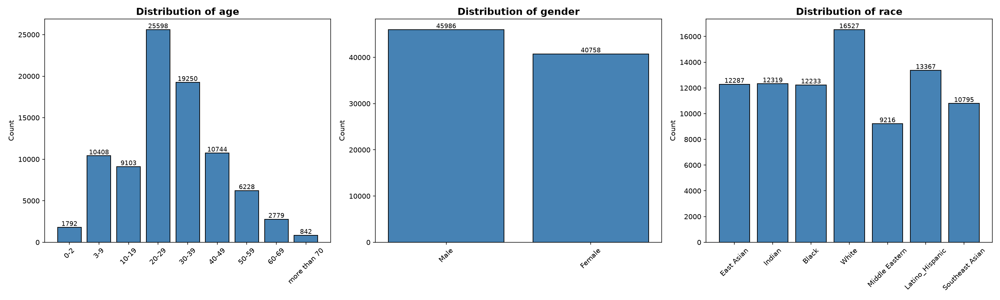
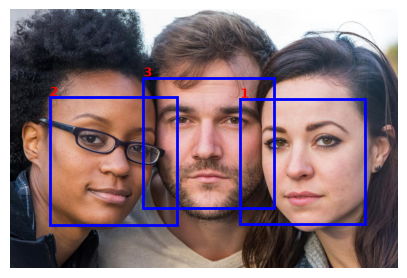

# Multi-Task Face Attribute Classification with Vision Transformers

A multi-task facial attribute classification project using pretrained Vision Transformer (ViT) backbones and the [FairFace](https://huggingface.co/datasets/HuggingFaceM4/FairFace) dataset.

Given a face image, the model predicts three attributes:

- **Age group** — 9 classes
- **Gender** — 2 classes
- **Race** — 7 classes

The project evaluates three pretrained ViT-based backbones: **CLIP ViT-B/16**, **SigLIP ViT-B/16**, and **DINOv2 ViT-B/14**.

## Overview

The main goal of the project is to investigate how different pretrained visual representations perform on a multi-task facial attribute classification problem.

Instead of training a Vision Transformer from scratch, pretrained backbones are used as the starting point, with task-specific prediction heads for age, gender, and race.

The project also explores several training improvements across three experimental versions:

- **V1:** baseline training configuration
- **V2:** improved loss functions, learning-rate scheduling, and weighted-F1-based checkpoint selection
- **V3:** ordinal age prediction with CORN and parameter-efficient fine-tuning with LoRA

## Dataset

The project uses the **FairFace** dataset.

- Train: **86,744** images
- Validation: **5,477** images
- Test: **5,477** images
- Image resolution: **224 × 224**
- RGB face images

### Labels

| Attribute | Classes |
|---|---:|
| Age | 9 |
| Gender | 2 |
| Race | 7 |

Age groups:

`0–2`, `3–9`, `10–19`, `20–29`, `30–39`, `40–49`, `50–59`, `60–69`, `70+`

Gender:

`Male`, `Female`

Race:

`East Asian`, `Indian`, `Black`, `White`, `Middle Eastern`, `Latino/Hispanic`, `Southeast Asian`

The dataset has some class imbalance, especially for age.

## Model Architecture

The project evaluates three pretrained Vision Transformer backbones:

| Backbone | Architecture |
|---|---|
| [CLIP](https://huggingface.co/openai/clip-vit-base-patch16) | ViT-B/16 |
| [SigLIP](https://huggingface.co/google/siglip-base-patch16-224) | ViT-B/16 |
| [DINOv2](https://huggingface.co/facebook/dinov2-base) | ViT-B/14 |

The backbone representation is passed to three task-specific heads:

- **Gender:** linear layer → 1 logit
- **Race:** linear layer → 7 logits
- **Age:** MLP → 9 age classes in the final classification setup

The final V3 configuration additionally uses **LoRA** for parameter-efficient fine-tuning of the backbone.

## Preprocessing and Augmentation

All images are resized to **224 × 224** and normalized according to the corresponding pretrained model processor.

Training augmentation includes:

- Random horizontal flip
- Random rotation
- Color jitter
- Gaussian blur

Additional augmentation is applied to minority age groups.

The validation set uses resizing and normalization without augmentation.

## Training

All three backbones are trained using the same general multi-task framework.

### Losses

- **Gender:** `BCEWithLogitsLoss`
- **Race:** weighted cross-entropy
- **Age:** CORN ordinal regression in V3, with an additional MAE-based penalty

The final age loss is:

**CORN loss + 0.1 × MAE penalty**

### Model Selection

The final training versions use a task-weighted F1 score for checkpoint selection:

| Task | Weight |
|---|---:|
| Gender F1 | 0.25 |
| Race F1 | 0.35 |
| Age F1 | 0.40 |

This gives more importance to age and race performance in the overall model selection score.

### Version Progression

**V1 — Baseline**

- AdamW optimizer
- Fixed learning rate
- No learning-rate scheduler
- Average validation accuracy for checkpoint selection

**V2 — Improved Training**

- Linear warmup + cosine annealing
- Weighted cross-entropy for imbalanced tasks
- Label smoothing for age
- Weighted F1 for checkpoint selection

**V3 — Ordinal Age + LoRA**

- CORN for age prediction
- MAE-based ordinal penalty
- LoRA parameter-efficient fine-tuning
- Updated learning-rate and warmup configuration
- Weighted F1 for checkpoint selection

## Inference

The inference pipeline accepts an input image and uses **MediaPipe Face Detection** to locate faces before running the trained FairFace classifier.

For each detected face, the pipeline crops and preprocesses the region, then classifies the face into an age group, gender, and race category.
## Results

After selecting the best V3 checkpoint using the validation set, the models were evaluated on the held-out test set.

### Final Test Results

| Backbone | Gender Acc. | Gender F1 | Age Acc. | Age F1 | Age MAE | Race Acc. | Race F1 |
|---|---:|---:|---:|---:|---:|---:|---:|
| **CLIP ViT-B/16** | **0.9615** | **0.9590** | **0.6180** | **0.5893** | **0.4079** | **0.7535** | **0.7513** |
| SigLIP ViT-B/16 | 0.9492 | 0.9464 | 0.5927 | 0.5524 | 0.4523 | 0.7190 | 0.7175 |
| DINOv2 ViT-B/14 | 0.9564 | 0.9538 | 0.5897 | 0.5599 | 0.4490 | 0.7186 | 0.7175 |

Additional results from all experimental versions are available in the [`evaluation_results/`](evaluation_results/) directory.

## References

- [FairFace dataset](https://huggingface.co/datasets/HuggingFaceM4/FairFace)

- [CLIP — Learning Transferable Visual Models From Natural Language Supervision](https://arxiv.org/abs/2103.00020)

- [SigLIP — Sigmoid Loss for Language Image Pre-Training](https://arxiv.org/abs/2303.15343)

- [DINOv2 — Learning Robust Visual Features without Supervision](https://arxiv.org/abs/2304.07193)

- [CORN — Deep Neural Networks for Rank-Consistent Ordinal Regression Based On Conditional Probabilities](https://arxiv.org/abs/2111.08851)

- [LoRA — Low-Rank Adaptation of Large Language Models](https://arxiv.org/abs/2106.09685)